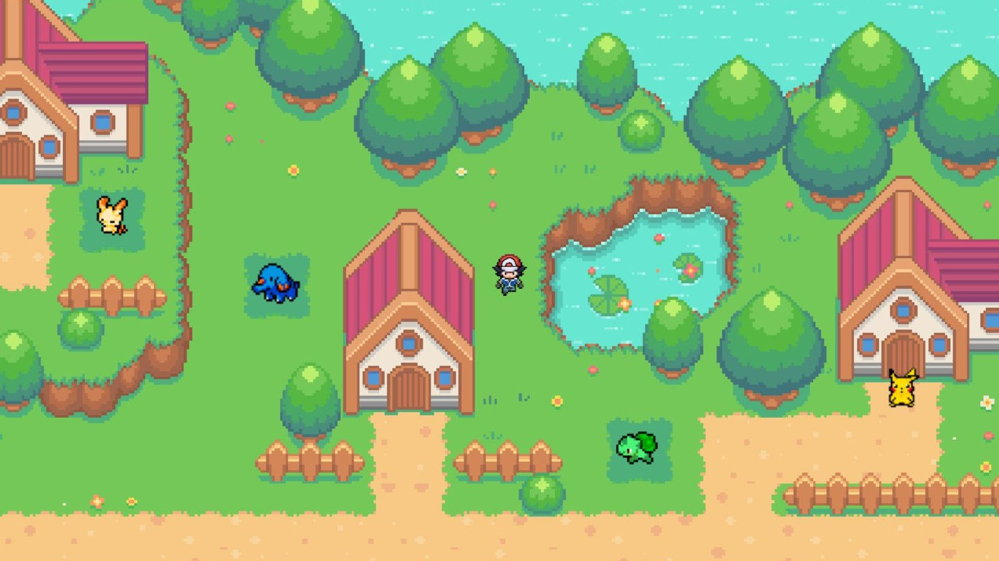

# pokemon-island
Fun game inspired by pokemon made in Javascript using Canvas

Still in progress...

# Storyline
The game starts with you arriving on the island by boat. 

As you get off the dock and start exploring, you notice the island is empty and all the little homes have been abandonded, or so it looks like. 
An evil wizard has taken all of the pokemons into his cave up in the snowy mountains! You must fight the wizard to save the pokemons and bring them back home.

# Map
The map was created in Tiled using game assets from itch.io. You can find the link in the "Credits" section.

# Gameplay

# How to play
Use arrow keys to move around. Once you step onto a battle field (marked by a darker patch of grass), you fight the wizard. If you defeat him, you bring a pokemon back to the island. Bring all the pokemons back home to win the game.

# Credits
Game assets used to create the map were made by Cyporkador on itch.io. You can find them here: [https://itch.io/](https://cypor.itch.io/12x12-rpg-tileset)

Sprites used for the player were made by keith13024 on deviantart.com. You can find them here: [https://devianart.com/](https://keith13024/art/Ash-kalos-overworld-sprite-by-Keith13024-597851130)

Pokemon sprites were made by pokemonanimalcrossinggirl on tumblr.com. You can find them here: [https://tumblr.com/](https://pokemonanimalcrossinggirl.tumblr.com/post/90577350536)

